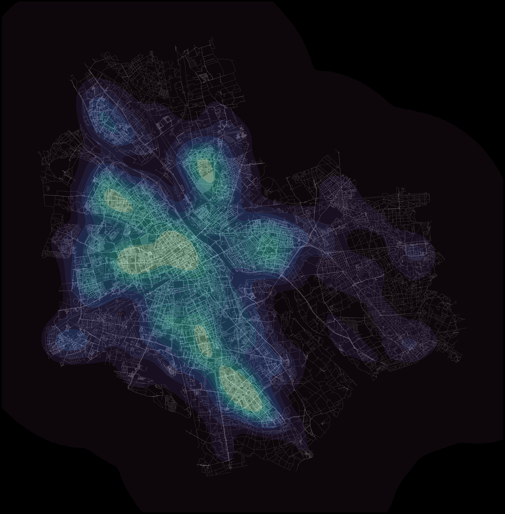
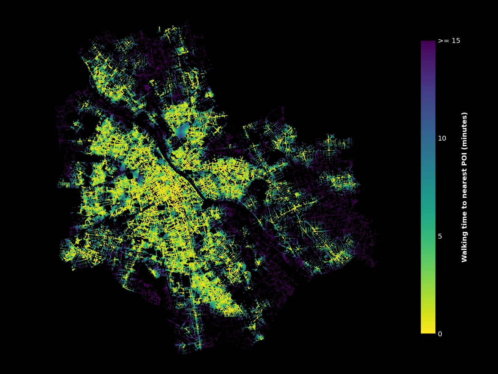
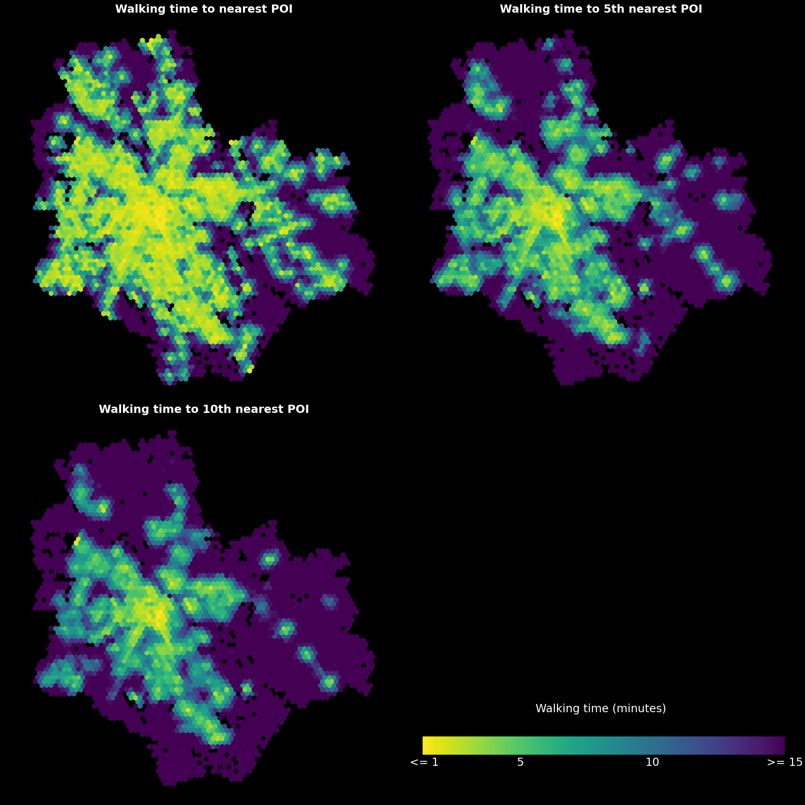

## Analysing urban walkability

Urban walkability can be understood and measured in many different ways. Because of this, the term is difficult to define. To say a place is walkable could for example mean that the network of streets is dense or that a wide selection of services is accessible on foot. Other urban elements such as green space, air quality or the amount of traffic affect walkability too.

Here I will analyze urban walkability with two network-based approaches. First, I will focus on the structure of a street network by simply calculating intersection densities. Then, with a bit more complex approach, I will run a city-wide routing analysis to find out how different urban features can be accessed on foot within a city.

All the analyses are done with open tools and data. The street network and urban features are from [OpenStreetMap](https://www.openstreetmap.org/) (OSM), and the analyses are performed using the [OSMnx](https://osmnx.readthedocs.io/en/stable/), [Pandana](https://udst.github.io/pandana/) and [GeoPandas](https://geopandas.org/) python libraries. Visualizations are a mix of [Matplotlib](https://matplotlib.org/) and [Seaborn](https://seaborn.pydata.org/).

While in this post I analyze the walkability in Warsaw, Poland, the workflow is directly transferable across any city with sufficient OSM data. The complete workflow and code is found in the two notebooks in this repository.

<br/>

### 1. Intersection density as an indicator of walkability

**Theoretical basis**

Intersection density tells us how dense and connected a street network is. These indicators are directly linked with how walkable a place is. An area with a dense network has fewer inaccessible spots in it, and a high connectivity makes for more diverse and efficient route possibilities. Scientific literature backs this up: a positive correlation between intersection density and walking as a transport method has been consistently demonstrated (For example see [Ewing & Cervero 2010](https://doi.org/10.1080/01944361003766766)).

**OSMnx and graphs**

From OSMnx's documentation:

>*OSMnx is a Python package that lets you download geospatial data from OpenStreetMap and model, project, visualize, and analyze real-world street networks and any other geospatial geometries.* 

In the first half of the analysis I used OSMnx to download the walkable street network of the analysis area and to construct a graph from that network. A graph consists of edges (walkable paths in this case) and nodes (points in which the edges intersect).


*The edges of Warsaw's walkable street network.*

The resulting graph is very dense and has a ton of nodes. This can be problematic. For example, if two paths merge with a third path at just slightly different points, one real-life intersecion can turn into 2 nodes. In this analysis my aim was to to model actual intersections only, which is why I chose to simplify the graph a bit. I dissolved all nodes within five meters of each other into single nodes and excluded all dead-ends. The result is not perfect, but I think it represents the "real-life" intersections better than the original graph.


*The original (left) and simplified (right) graphs side by side.*

<br/>

**Visualizing intersection density**

The simplification nearly halved the intersection count: from 177 207 to 96 414. Still, a plain cluster of nodes isn't exactly an informative display of the data. To better visualize the spatial variance in the intersection density I first used Matplotlib's hexbin functionality and then experimented a bit with Seaborn's kernel density estimate (KDE) plots.


*Intersections aggregated to a hexagonal grid*


*Seaborn's KDE plotting is another cool way to visualize point densities.*

<br/>

### 2. Walkability measured with access to sociable places

**Alternative indicators for walkable urban space**

The first part of the analysis relied on the assumption that a dense urban fabric indicates a walkable place. While the physical structure of the street network definitely plays a part, there's much more to urban space than intersection counts. So, to get a different insight into urban walkability, I took a slightly more qualitative approach.

Novack et al. (2018) discuss in their [article](https://doi.org/10.3390/s18113794) how different urban features affect the pleasantness of urban space. This article was helpful as the study was done using OSM data, and the authors even provide lists of different features that make urban space pleasant. For my analysis I used their list of OSM features that indicate sociable places, or so called ["third places"](https://en.wikipedia.org/wiki/Third_place):

```python
tags = {
    'amenity':[
        'cafe',
        'bar',
        'pub',
        'restaurant'
    ],
    'shop':[
        'bakery',
        'convenience',
        'supermarket',
        'mall',
        'department_store',
        'clothes',
        'fashion',
        'shoes'
    ],
    'leisure':[
        'fitness_centre'
    ]
}
```
*The OSM tags used in the analysis.*

<br/>

**Routing analysis**

With this list of OSM tags I downloaded the corresponding points of interest (POIs) from OSM using OSMnx. Then, with a combination of OSMnx and Pandana, I created a routable network to which I set the locations of the POIs. For this part of the analysis I used the complete, unsimplified graph. The routing analysis uses both the nodes and the edges of the graph, so keeping the precise geometry leads to more accurate travel time calculations. 

After the network was constructed, I ran the routing analysis with Pandana. The analysis calculates the travel time from every network node to a specified number of nearest POIs. I specified that 10 nearest POIs should be routed to which means that in the result every network node has a maximum of 10 different travel time values: time to to 1st, 2nd, 3rd, ... 10th nearest POI. The travel times are based on the assumption that the average walking speed is 4.5 km/h. Additionally I limited the analysis to only calculate travel times to POIs that are within a 15-minute walk.


*Walking time from every node to the nearest POI.*

The resulting visualization is a bit cluttered. To get a clearer overview of the data, I once again used Matplotlib's hexbins. Instead of amounts of points, I calculated the average travel times for every hexagon this time.

Another thing to note is that visualizing travel times only to the nearest POI probably isn't the ideal approach. For example, if one place had one cafe and another place had a cluster of multiple restaurants and shops, both places would look nearly identical on the map. Plotting the travel times to, for example, the 5th nearest POI would fix this, as singular features wouldn't affect the map as much. Below is a comparison of how the visualization changes when the selection of walking time is changed between nearest, 5th nearest and 10th nearest POI.


*Comparison of walking times to different routing targets.*

This visualization is much better, and it clearly shows areas where sociable urban places can and cannot be accessed on foot. Some correlation can be found between these maps and the intersection density, but there are also areas that are noticeably more or less "walkable" depending on the method.

<br/>

### 3. Conclusion

This blog post showcased two network-based methods of analyzing walkability. Focusing only on network density is a very quantifiable approach, but it completely ignores other qualities of the urban space being analyzed. Approaching walkability as a measure of how certain urban features can be accessed by walking is one possible way to combine the qualitative aspect of walkability with network analysis. Of course, the results of this approach are completely dependent on the types of features selected. This could be an interesting topic for further research: the analysis could, for example, reveal areas that are more or less walkable to certain groups of people by selecting features that are important to them specifically.

<br/>

### 4. Some useful resources

**A great overview of some key concepts:**

Ewing, R., & Cervero, R. (2010). Travel and the built environment: A meta-analysis. Journal of the American planning association, 76(3), 265-294. https://doi.org/10.1080/01944361003766766

**More about OSMnx:**
- Boeing, G. 2017. OSMnx: New Methods for Acquiring, Constructing, Analyzing, and Visualizing Complex Street Networks. *Computers, Environment and Urban Systems 65*, 126-139. doi:10.1016/j.compenvurbsoys.2017.05.004

- Boeing's excellent and openly available [Advanced Urban Analytics](https://github.com/gboeing/ppd599) course was also a major inspiration, especially to the routing analysis portion of this post.

- [Examples of OSMnx usage](https://github.com/gboeing/osmnx-examples)

**Article that deals with OSM features as predictors of urban space quality:**
- Novack, T., Wang, Z., & Zipf, A. (2018). A system for generating customized pleasant pedestrian routes based on OpenStreetMap data. *Sensors, 18*(11), 3794. https://doi.org/10.3390/s18113794

**Documentation of the libraries used:**
- Links in the [introduction](#analysing-urban-walkability)