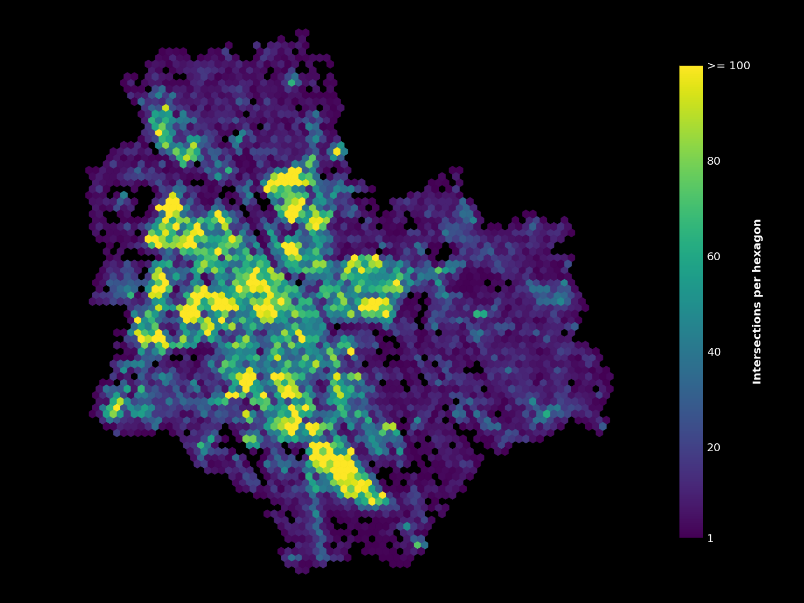

## Analysing urban walkability

Urban walkability sounds like a self-explanatory term: it measures how accessible an urban environment is by walking. However, the factors that make up walkability are hard to define, and, consequently, walkability can be understood and measured in many different ways. To say a place is walkable could, for example, mean that the network of streets is dense or that a wide selection of services can be accessed on foot. Other urban elements such as green space, air quality or the amount of traffic affect walkability too.

In this post I will analyze urban walkability with two network-based approaches. First, I will focus on the structure of a street network by simply calculating intersection densities. Then, with a bit more complex approach, I will run a city-wide routing analysis to find out how different points of interest can be accessed on foot within an urban area.

The data and tools used in the analysis are all open. The street network and urban features are from OpenStreetMap (OSM), and the different analyses are done using the [OSMnx](https://osmnx.readthedocs.io/en/stable/), [pandana](https://udst.github.io/pandana/) and [geopandas](https://geopandas.org/) python packages. Visualizations are a mix of matplotlib and seaborn. While in this post I mainly analyze the walkability in Warsaw, Poland, the workflow is directly transferable across any city with sufficient OSM data.

<br/>

### 1. Intersection density as an indicator of walkability

**OSMnx and graphs**

From OSMnx's documentation:

>*OSMnx is a Python package that lets you download geospatial data from OpenStreetMap and model, project, visualize, and analyze real-world street networks and any other geospatial geometries.* 

In the first half of the analysis I used OSMnx to download the walkable street network of the analysis area, and to construct a graph from that network. A graph comprises of edges (walkable paths in this case) and nodes (points in which the edges intersect).


*The egdes of Warsaw's walkable street network*

The resulting graph is very dense and has a ton of nodes. This can be problematic. For example, if two paths merge with a third path at even slightly different points, one real-life intersecion can turn into 2 nodes. In this analysis I tried to model actual intersections only, which is why I chose to simplify the graph a bit. I dissolved all nodes within five meters of eachother into single nodes and excluded all dead-ends. The result is not perfect, but I think it represents the "real-life" intersections better than the original graph.


*The original (left) and simplified (right) graphs side by side*

<br/>

**Visualizing intersection density**

The simplification nearly halved the intersection count: from 177 207 to 96 414. Still, just a heap of nodes isn't really an informative display of the data. To better visualize the intersection density I first used matplotlib's hexbin functionality and then experimented a bit with seaborn's kernel density estimate (KDE) plots.


*Intersections aggregated to a hexagonal grid*


*Seaborn's KDE plotting is another cool way to visualize point densities*

<br/>

### 2. Walkability measured with access to sociable places

**Alternative indicators for walkable urban space**

The first part of the analysis relied on the assumption that a dense urban fabric indicates a walkable place. While the pshysical structure of the street network definitely plays a part, there's much more to urban space than intersection counts. So, to get a different insight into urban walkability, I took a slighlty more qualitative approach.

Novack et al. (2018) discuss in their [article](https://doi.org/10.3390/s18113794) how different urban features affect the pleasantness of urban space. This article was helpful as the study was done using OSM data, and the authors even provide lists of different features that make urban space pleasant. For my analysis I used their list of OSM features that indicate sociable places, or so called ["third places"](https://en.wikipedia.org/wiki/Third_place):

```python
tags = {
    'amenity':[
        'cafe',
        'bar',
        'pub',
        'restaurant'
    ],
    'shop':[
        'bakery',
        'convenience',
        'supermarket',
        'mall',
        'department_store',
        'clothes',
        'fashion',
        'shoes'
    ],
    'leisure':[
        'fitness_centre'
    ]
}
```
*The OSM tags used in the analysis*

<br/>

**Routing analysis**

With this list of OSM tags I downloaded the corrseponding points of interest (POIs) from OSM using OSMnx. Then, with a combination of OSMnx and pandana, I created a routable network to which I set the locations of the POIs. For this part of the analysis I used the complete, unsimplified graph. Instead of just nodes the routing analysis uses the whole network, so keeping the precise geometry leads to more accurate travel time calculations. 

After the network was constructed, I ran the routing analysis with pandana. The analysis calculates the travel time from every network node to a specified number of nearest POIs. I specified that 10 nearest POIS should be routed to which means that in the result every network node has a maximum of 10 different travel times: time to to 1st, 2nd, 3rd, ... 10th nearest POI. The travel times are based on the assumption that average walking speed is 4.5 km/h. Additionally I limited the analysis to only calculate travel times to POIs that are within a 15-minute walk.


*Walking time from every node to the nearest POI.*

The resulting visualization is a bit cluttered. To get a clearer view to the data, I once again used matplotlib's hexbins. Instead of amounts of points, I calculated the average travel times for every haxagon this time.

Another thing to note is that only visualizing the travel times to the nearest POIs probably isn't the ideal approach. For example, if one place had one cafe and another place had a cluster of multiple restaurants and shops, both places would look nearly identical on the map. Plotting the travel times to, for example, the 5th nearest POI would fix this, as singular fetures wouldn't affect the map as much. Below is a comparison of how the visualization changes when the selection of walking time is changed between nearest, 5th nearest and 10th nearest POI.


*Comparing different routing analyses*

This visualization is much better, and it shows some distinct areas where sociable urban places can and cannot be found. When comparing these maps to the intersection density some correltaion can be found, but there are also areas that are noticeably more or less prominent depending on the method.

<br/>

### 3. References

Boeing, G. 2017. OSMnx: New Methods for Acquiring, Constructing, Analyzing, and Visualizing Complex Street Networks. *Computers, Environment and Urban Systems 65*, 126-139. doi:10.1016/j.compenvurbsys.2017.05.004
