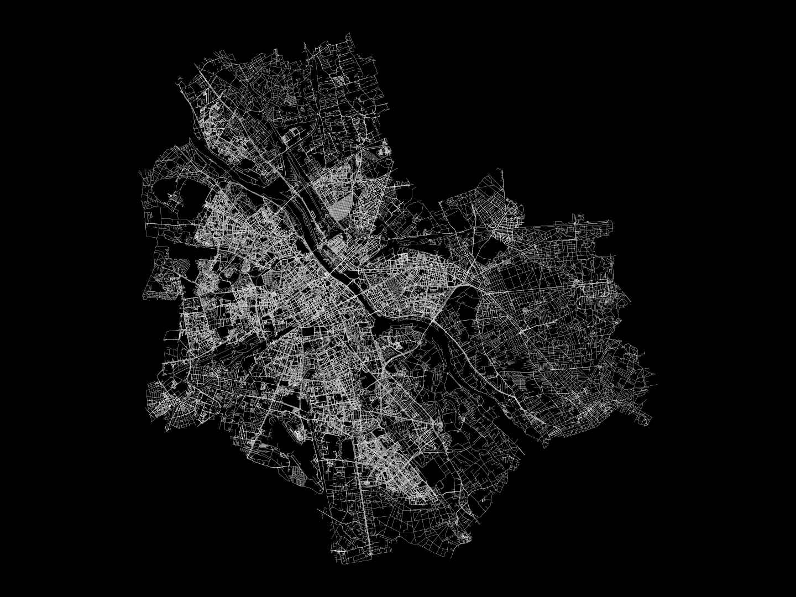

## Analysing of urban walkability

Urban walkability sounds like a self-explanatory term: it measures how accessible an urban environment is by walking. However, the factors that make up walkability are hard to define, and, consequently, walkability can be understood and measured in many different ways. To say a place is walkable could, for example, mean that the network of streets is dense or that a wide selection of services can be accessed on foot. Other urban elements such as green space, air quality or the amount of traffic affect walkability too.

In this post I will analyze urban walkability with two different approaches. First, I will focus on the structure of a street network by simply calculating intersection densities. Then, with a bit more complex approach, I will run a city-wide routing analysis to find out how different points of interest can be accessed on foot within an urban area.

All the analyses are done with OpenStreetMap (OSM) data, using the OSMnx, pandana and geopandas python packages. While in this post I analyze the walkability in Warsaw, Poland, the workflow is directly transferable across any city with sufficient OSM data.

### 1. OSMnx, graphs and intersection counts

>[OSMnx](https://osmnx.readthedocs.io/en/stable/) is a Python package that lets you download geospatial data from OpenStreetMap and model, project, visualize, and analyze real-world street networks and any other geospatial geometries. 

road  

Also, when dealing with OSM data, one should keep in mind that some of the variance in data coverage and detail is just an inevitable by-product of the various mapping habits of OSM contributors.

**Simplifying graphs**

The resulting graph is very dense and has a ton of nodes. This can be problematic. For example, if two paths merge with a third path at even slightly different points, one real-life intersecion can turn into 2 nodes. In this analysis I tried to model actual intersections only, which is why I chose to simplify the graph a bit. I dissolved all nodes within five meters of eachother into single nodes and excluded all dead-ends. The result (picture 1) is not perfect, but I think it represents the "real life" intersections better than the original graph.

### 2. Network analysis

For the network analysis I used the complete walkable network without any simplification. Instead of just nodes, the routing analysis uses the whole graph, and keeping the precise geometry leads to more accurate walk times.

### 3. References

Boeing, G. 2017. OSMnx: New Methods for Acquiring, Constructing, Analyzing, and Visualizing Complex Street Networks. *Computers, Environment and Urban Systems 65*, 126-139. doi:10.1016/j.compenvurbsys.2017.05.004

